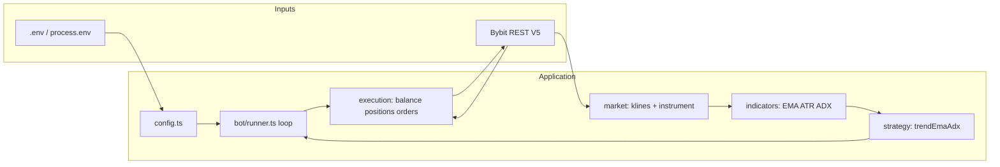

# Bybit Trend Bot

**Automated trend-following execution on Bybit V5 (USDT linear perpetuals)**

TypeScript · Node.js 20+ · [Bybit V5 REST API](https://bybit-exchange.github.io/docs/v5/guide) · Unified account (see `src/execution/account.ts`)

**New to bots?** Start with the [Beginner guide: using this bot](#beginner-guide-using-this-bot) (step-by-step: install, keys, dry-run, testnet, then mainnet).

---

## Overview

This repository implements a **single-symbol, trend-following** trading loop for **Bybit linear USDT perpetuals**. The strategy combines **EMA crossover** for directional bias, **ADX** and **directional movement (+DI/−DI)** for regime filtering, and **ATR** for stop distance, take-profit levels, and **risk-based position sizing**. Market data and execution are separated from indicator and strategy logic to support testnet, dry-run, and signed live trading on a predictable polling cadence.

**This is research and execution software, not a product with guaranteed returns.** Past or hypothetical results do not predict live performance. Cryptocurrency derivatives are high risk; you are solely responsible for API keys, margin, compliance, and capital deployed.

---

## Beginner guide: using this bot

If you have never run a trading bot before, follow these steps in order. **Do not skip testnet and dry-run** until you know what the logs mean.

### 0) Get the project on your computer (very first step)

**Goal:** a folder on your machine that contains `package.json` and a `src/` directory — that is the **project root** for every later command.

**Option A — Git clone (recommended if the code is on GitHub, GitLab, or similar):**

1. Install [Git](https://git-scm.com/downloads) if you do not have it. Check with:

   ```bash
   git --version
   ```

2. In a folder where you keep projects, clone the repository (replace the URL with **your** repo or fork):

   ```bash
   git clone https://github.com/YOUR_USER/YOUR_REPO.git
   cd YOUR_REPO
   ```

   If you use **SSH** (with keys on your Git account):

   ```bash
   git clone git@github.com:YOUR_USER/YOUR_REPO.git
   cd YOUR_REPO
   ```

3. You should see `package.json` in the current directory:

   ```bash
   # Windows (PowerShell or cmd)
   dir package.json

   # macOS / Linux
   ls package.json
   ```

4. **Later, to pull updates** (new commits from the same remote), use:

   ```bash
   cd YOUR_REPO
   git pull
   ```

   Then run `npm install` again in case `package.json` changed.

**If the folder name has spaces** (e.g. `bybit trading bot`), always quote the path when you `cd`:

```bash
cd "bybit trading bot"
```

**Option B — You already have the folder (ZIP, USB, Cursor/Copilot, or copy from a friend):**

- Unzip or open that folder, then in a terminal **go into the folder** that directly contains `package.json` and `src/`. That folder is your project root — same as after `git clone` + `cd`.

**Option C — You opened this project in an IDE:**

- Open the **integrated terminal** in the project root (the directory with `package.json`) so `npm` commands run in the right place.

**Then continue to step 1 below.**

### 1) What you need before you start

| You need | Notes |
|----------|--------|
| A computer with **Node.js 20+** | [Download Node](https://nodejs.org/) (LTS is fine). In a terminal, run `node -v` — it should show `v20` or higher. |
| The **project root** (from step 0) | The folder with `package.json` and `src/`. All commands like `npm install` run **here**. |
| **Git** (optional) | Only required if you use **Option A** in step 0. |
| A **Bybit** account | You will create **API keys** on [Bybit](https://www.bybit.com/) (main) or [Testnet](https://testnet.bybit.com/) (fake money for learning). |
| Patience to read the logs | The bot only prints text to the terminal. There is no built-in website or app UI. |

**You do *not* need to know the math behind EMA/ADX/ATR on day one** — but you *do* need to understand **testnet vs mainnet** and **dry-run vs real orders** (see below).

### 2) Four switches every beginner should understand

| Switch | Set to | What it means in plain language |
|--------|--------|---------------------------------|
| `BYBIT_TESTNET` | `true` first | Talk to **Bybit’s practice server**; balances are not real mainnet money. |
| `BYBIT_TESTNET` | `false` | Talk to **real Bybit** — real money and real risk. |
| `DRY_RUN` | `true` | The bot may **read** prices and (with keys) your balance, but it **will not** place orders or set stop-loss/take-profit. **Safest to learn signals.** |
| `DRY_RUN` | `false` | The bot will **place real orders** (when keys are set and the strategy wants to trade). **Use only on testnet first, then small size on mainnet if you accept the risk.** |

**Rule of thumb:** learn with **`DRY_RUN=true`**, then test orders with **`BYBIT_TESTNET=true`** and **`DRY_RUN=false`**, only then consider **mainnet** with **`BYBIT_TESTNET=false`**.

### 4) Install dependencies and the `.env` file (one time)

1. In the **project root** (where `package.json` is; see **0) Get the project on your computer** above), run:

   ```bash
   npm install
   ```

2. If that fails, check that you are in the correct directory and that Node 20+ is installed.

3. Create your local settings file (do **not** share or upload this file):

   ```bash
   # Windows (Command Prompt)
   copy .env.example .env

   # macOS / Linux
   cp .env.example .env
   ```

4. Open `.env` in a text editor. You will come back to this file many times.

### 5) Create Bybit API keys (beginner-friendly)

1. **Use testnet first:** go to [Bybit testnet](https://testnet.bybit.com/), create or log in, and go to the **API** section (wording may vary: “Create API key”).
2. Create a key with **trading** permission for the account type you use (e.g. **unified** / contract as required by the exchange). **Do not** enable **withdrawal** for a bot that only trades — that limits damage if a key leaks.
3. Save the **key** and **secret** in a safe place. **You may only see the secret once.**
4. Paste them into `.env` as `BYBIT_API_KEY` and `BYBIT_API_SECRET` (no quotes, no extra spaces, one key per line).
5. In `.env`, set `BYBIT_TESTNET=true` so the bot uses the **testnet** API host. Keys from testnet and mainnet are **not** interchangeable.

If something says “unauthorized” or “invalid key,” the host (`BYBIT_TESTNET`) and the key origin (testnet vs main) **must match**.

### 6) First run: signals only (no orders)

Goal: see **`Starting`**, **`Instrument rules loaded`**, and **`Signal`** lines without spending anything.

1. In `.env`, set:
   - `DRY_RUN=true`
   - `BYBIT_TESTNET=true`
   - You may leave keys **empty** for a pure dry run of signals, **or** add keys to also see `equityUsd` / `qty` in **dry-run** logs.
2. Start the bot:

   ```bash
   npm start
   ```

3. **Good signs:** lines like `Signal` with `signal`, `close`, `adx`, `atr`. If you see **`Not enough data or indicators warming up`**, wait — the first bars may still be loading.
4. **Stop the bot:** press **Ctrl+C** in the same terminal. It is normal to start and stop often while learning.

If the program exits immediately with an error, read the message; often it is a missing/invalid `FAST_EMA`/`SLOW_EMA` pair or a typo in `.env`. See [Troubleshooting](#troubleshooting).

### 7) Second run: same as live, but no orders (recommended)

1. Keep `DRY_RUN=true` and `BYBIT_TESTNET=true`.
2. With **testnet keys** in `.env`, the bot can **read** your testnet balance and show **`DRY_RUN (no orders)`** with a computed **`qty`**.
3. Check that `qty` is not always `null` (if it is, your balance may be too small for the **minimum order size** or your **risk** settings are too low — see [Configuration](#configuration) and the sizing table in [User reference](#user-reference-data-costs-and-operations)).

This step proves your **API key works** and **sizing** is in a sensible range before any click-to-trade.

### 8) Testnet *live* trading (real API orders, not real money on mainnet)

1. In `.env` set: `DRY_RUN=false`, `BYBIT_TESTNET=true`, and your **testnet** keys.
2. On **Bybit testnet**, set **leverage** and **position mode (one-way)** the way you want **before** relying on the bot. This repo does not set them for you.
3. Set **small** values in `.env` while learning, e.g. low **`RISK_PER_TRADE`** and a tight **`MAX_ORDER_QTY`**, and an interval you understand (e.g. `INTERVAL=15` minutes).
4. Run `npm start` and **watch the terminal**. You should only move on when you have seen an **open**, **brackets (SL/TP)**, and understand how a **flip** or **error** looks in the log.
5. **Stop** with Ctrl+C when done.

**Testnet** can behave differently from mainnet (liquidity, fills). It is for **process** learning, not for proving profit.

### 9) When you are ready for mainnet (read twice)

1. You have completed **8)** and you understand what each log line means.
2. Create **separate** **mainnet** API keys; never reuse testnet keys on main.
3. Set `BYBIT_TESTNET=false` and point `.env` to **mainnet** keys.
4. Use **only capital you can afford to lose**; start with the **smallest** `RISK_PER_TRADE` and `MAX_ORDER_QTY` you can.
5. Keep your machine and `.env` **private**; read [Security](#security).

### 10) On the Bybit app when the bot is running

You can always log in to **Bybit (web or app)** in parallel and check **positions**, **open orders**, and **wallet** balance. If the bot says it opened a position but you do not see it, wait a few seconds, refresh, and confirm the **symbol** and **account** (testnet vs main) match your `.env`.

### 11) Common beginner mistakes

| Mistake | How to avoid |
|--------|---------------|
| Mainnet key on testnet host (or the reverse) | `BYBIT_TESTNET` and key source must **match**. |
| `DRY_RUN=false` on the first run | Start with `DRY_RUN=true` to learn. |
| Expecting the bot to “set leverage” for you | Set leverage and one-way mode on **Bybit** before relying on size and risk. |
| **Flat** signal with an open position | **Flat** does not auto-close; see [Strategy and position logic](#strategy-and-position-logic). |
| Stopping the bot to “lock profit” | Open positions **remain on the exchange** after you stop the process. Close in the app or with rules you design. |

### 12) Where to read next in this README

| Goal | Section |
|------|---------|
| All environment variables | [Configuration](#configuration) |
| What each line in the log means | [Logging](#logging) and [User reference](#user-reference-data-costs-and-operations) |
| How signals and flips work | [Strategy and position logic](#strategy-and-position-logic) |
| Command-line commands | [Quick start](#quick-start) |
| Problems | [Troubleshooting](#troubleshooting) |

---

## At a glance

| Topic | Value |
|--------|--------|
| **Package** | `bybit-trend-bot` (see `package.json`) |
| **Runtime** | Node.js **20+** · ESM · native `fetch` |
| **Exchange** | [Bybit V5](https://bybit-exchange.github.io/docs/v5/guide) |
| **Market** | **USDT-margined linear perpetuals** (single `SYMBOL` per process) |
| **Position mode** | **One-way** (`positionIdx: 0`); not hedge mode |
| **Account** | **Unified** USDT balance parsing (typical `UNIFIED` wallet flow) |
| **Entries / exits** | **Market** orders; SL/TP via **`/v5/position/trading-stop`** |
| **Data feed** | **REST** polling of **closed** klines (no built-in WebSocket) |
| **Min loop interval** | **5000 ms** (`POLL_MS` floor in `config.ts`) |
| **Default risk** | `RISK_PER_TRADE=0.005` → **0.5%** of USDT equity per trade’s *stop-distance* risk budget (before `min`/`max`/`MAX_ORDER_QTY` caps) |
| **Default ATR R:R (distance)** | `ATR_TP_MULT / ATR_STOP_MULT` → **2:1** (e.g. 3.5 / 1.75) — not guaranteed realized R |

---

## User reference: data, costs, and operations

This section answers common **“what will I see?”** and **“what should I set on Bybit?”** questions.

### Kline intervals (from `.env.example`)

Set `INTERVAL` to one of the values Bybit supports for your symbol, for example: **1, 3, 5, 15, 30, 60, 120, 240, 360, 720, D, W, M** (confirm in [Bybit kline docs](https://bybit-exchange.github.io/docs/v5/market/kline) if your contract differs). Shorter intervals → more often **new closed bars** and more frequent signal checks; they do **not** by themselves make the strategy more profitable.

### History length and “warm-up”

Each tick requests enough closed klines to compute **slow EMA** and **ADX** (and ATR) reliably. The code uses:

`klineLimit = max(250, SLOW_EMA + ADX_PERIOD × 4 + 50)` bars (see `src/bot/runner.ts`).

If the API returns fewer bars or indicators are not ready, you may see **`Not enough data or indicators warming up; skipping tick.`** until history is sufficient.

### Dry-run vs live (what is real)

| Mode | Keys | Balance / position reads | **Orders, SL, TP** |
|------|------|----------------------------|---------------------|
| `DRY_RUN=true` | Optional | If keys set: may read **equity** to show hypothetical `qty` | **None** (no `order/create`, no `trading-stop`) |
| `DRY_RUN=false` | **Required** | **Equity** + **open position** each tick when trading | **Yes** (market + trading-stop) |

`BYBIT_TESTNET=true` only changes the **host** to testnet; it does not replace careful sizing and key hygiene.

### Approximate API traffic (planning, not a SLA)

| Phase | Calls (typical) |
|--------|------------------|
| **Startup** | Server time sync; **instrument** rules; then loop |
| **Each tick** | Klines (bulk GET); in **live** also position + balance when trading logic runs; **dry-run** with keys may sync time + equity for logging |
| **Open position** | Market order; **position** polls (short retry loop) for **entry**; **trading-stop** for SL/TP |
| **Flip** | **Reduce-only** close market → brief sleep → new market; position poll; **trading-stop** again |

Bybit [rate limits](https://bybit-exchange.github.io/docs/v5/rate-limit) apply; one symbol and multi-second polling are usually light, but testnet and mainnet limits differ.

### What each run cares about (trader checklist)

| Item | In this bot? | You handle on Bybit / elsewhere |
|------|----------------|----------------------------------|
| **Symbol** | `SYMBOL` | Pick a listed **linear USDT** perpetual. |
| **Leverage** | **No** | Set in Bybit (affects **liquidation** and PnL volatility). |
| **Cross / isolated, position mode** | **No** | Set in Bybit UI / API. |
| **Taker / maker fees** | **Not modeled** (entries are **market** = usually **taker**). | See your [fee tier](https://www.bybit.com/en-US/help-center). |
| **Funding** (perp) | **Not modeled** | Long/shorts pay or receive on schedule; can dominate short holds. |
| **Liquidation** | **Not modeled** | Depends on margin, leverage, and mark price. |
| **Tax / reporting** | **No** | Export from exchange or your tools. |

### Interpretation of logged signal fields

| Field | Meaning | Why users watch it |
|--------|---------|---------------------|
| `signal` | `long` / `short` / `flat` | The strategy’s current bar decision. |
| `close` | Last **closed** bar close | Price level used with ATR and sizing context. |
| `adx` | ADX (period `ADX_PERIOD`) | **Trend strength**; compared to `ADX_MIN`. |
| `atr` | ATR (period `ATR_PERIOD`) | **Volatility**; drives stop/TP **distance** and `qty` via `stopDist`. |
| `target` (dry-run) | `Buy` / `Sell` / `null` | What a live bot would *try* to align with (subject to `qty` and position rules). |
| `qty` | Contract size (base) | The size the bot **would** or **did** use after rules and caps. |
| `equityUsd` | USDT wallet equity used for risk | Drives `riskUsd = equity × RISK_PER_TRADE`. |

### Sizing at a glance (arithmetic only)

`RISK_PER_TRADE` is the fraction of **USDT equity** applied to the **notional** stop-distance budget `riskUsd`. The bot then sets `qty ≈ riskUsd / stopDist` with `stopDist = ATR × ATR_STOP_MULT` (and exchange min/max/step). This is **not** a promise of how much you will lose in USDT in a real trade (slippage, fees, partial fills, and **liquidation** can differ).

| Wallet equity (USDT) | `RISK_PER_TRADE` | `riskUsd` (used in formula) |
|----------------------|------------------|-----------------------------|
| 1,000 | 0.005 (0.5%) | **5** |
| 5,000 | 0.005 | **25** |
| 20,000 | 0.005 | **100** |
| 1,000 | 0.01 (1%) | **10** |

If `qty` is `null` in logs, often **`riskUsd` is too small** for **minQty** at current price/ATR, or **`MAX_ORDER_QTY`** is very tight.

---

## Table of contents

1. [Beginner guide: using this bot](#beginner-guide-using-this-bot)
2. [At a glance](#at-a-glance)
3. [User reference: data, costs, and operations](#user-reference-data-costs-and-operations)
4. [Features](#features)
5. [What the bot does and does not do](#what-the-bot-does-and-does-not-do)
6. [Architecture](#architecture)
7. [Strategy and position logic](#strategy-and-position-logic)
8. [Risk and position sizing](#risk-and-position-sizing)
9. [Bybit API surface](#bybit-api-surface)
10. [Requirements](#requirements)
11. [Quick start](#quick-start)
12. [Configuration](#configuration)
13. [Logging](#logging)
14. [Performance and validation](#performance-and-validation)
15. [Tuning and research notes](#tuning-and-research-notes)
16. [Limitations and known gaps](#limitations-and-known-gaps)
17. [Troubleshooting](#troubleshooting)
18. [Security](#security)
19. [Glossary and links](#glossary-and-links)
20. [FAQ](#faq)
21. [License](#license)

---

## Features

- **Closed-bar signals** on configurable kline interval; long / short / flat from EMA + ADX + DI rules.
- **Live mode** (when `DRY_RUN=false`): one-way linear positions (`positionIdx: 0`), **market** entries and flips, **trading-stop** for SL/TP, **reduce-only** exit before reverse entry when the signal flips.
- **Sizing** from USDT equity, ATR-based stop distance, and exchange `min` / `max` / `step` from instrument metadata, with a hard `MAX_ORDER_QTY` cap.
- **Clock sync** via `GET /v5/market/time` before signed requests.
- **Structured logging** to stdout (JSON lines) for monitoring and log aggregation.
- **Dry-run and testnet** for staged validation before mainnet use.

---

## What the bot does and does not do

### In scope

| Area | Behavior |
|------|----------|
| Data | Polls **closed** klines for `SYMBOL` and `INTERVAL`, recomputes indicators, emits **long / short / flat** each iteration. |
| Live trading | With `DRY_RUN=false`, opens and manages **one** linear position per symbol; **market** orders; attaches SL/TP via **trading-stop**; **flips** on signal reversal (close then new side). |
| Sizing | Derives quantity from equity and ATR stop distance, rounded to **qtyStep** and bounded by `minQty` / `maxQty` / `MAX_ORDER_QTY`. |
| Time | Synchronizes server time offset for request signing. |

### Out of scope

| Item | Note |
|------|------|
| Performance guarantees | No implied Sharpe, win rate, or drawdown limits. |
| Other products | **No** spot, options, inverse contracts, or multi-symbol portfolio logic in a single process. |
| Account setup | **No** automatic leverage, margin mode, or position mode; configure in Bybit. |
| Latency | **REST polling** only; not designed for sub-second or tick scalping. |
| Research suite | **No** in-repo backtest or walk-forward optimizer; export logs and analyze externally if needed. |

---

## Architecture



| Layer | Role | Main files |
|--------|------|------------|
| Entry | Process bootstrap | `src/index.ts` |
| Config | Environment parsing and validation | `src/config.ts` |
| Connectivity | HMAC-SHA256, HTTP GET/POST | `src/bybit/restClient.ts`, `src/bybit/sign.ts` |
| Market data | Klines, contract rules | `src/market/klines.ts`, `src/market/instrument.ts` |
| Indicators | EMA, ATR, ADX, +DI, −DI | `src/indicators/*.ts` |
| Strategy | Signal from OHLC series | `src/strategy/trendEmaAdx.ts` |
| Execution | Balance, position, orders, brackets | `src/execution/account.ts`, `src/execution/orders.ts` |
| Orchestration | Polling loop, dry-run path | `src/bot/runner.ts` |

---

## Strategy and position logic

### Signal (last fully closed bar)

Let **fast** and **slow** be EMA(close) with periods `FAST_EMA` and `SLOW_EMA`. **ADX**, **+DI**, and **−DI** use period `ADX_PERIOD` (Wilder-style smoothing as implemented in code).

| Signal | Conditions (on the latest bar) |
|--------|--------------------------------|
| **Long** | fast > slow, ADX ≥ `ADX_MIN`, +DI > −DI |
| **Short** | fast < slow, ADX ≥ `ADX_MIN`, −DI > +DI |
| **Flat** | All other cases |

**Flat** means no new entry aligned with a trend; it does **not** by itself close an open position in live mode.

### Live behavior (`DRY_RUN=false`)

| Open position | Target signal | Action |
|---------------|---------------|--------|
| None | Long or Short | Market open; then **trading-stop** (SL/TP) |
| Long | Short | Reduce-only market sell to flat; then market new short; new brackets |
| Short | Long | Reduce-only market buy to flat; then market new long; new brackets |
| Any | Flat | **No** automated exit (position remains; SL/TP or manual) |
| Long / Short | Unchanged side | **No** re-entry or bracket refresh in this version |

**Post-entry:** the runner reads **`/v5/position/list`** for average entry, then sets **`/v5/position/trading-stop`** with prices rounded to **tickSize**.

---

## Risk and position sizing

**Stop distance (price):** `stopDist = ATR × ATR_STOP_MULT`

**Notional risk budget (USDT):** `riskUsd = equityUsd × RISK_PER_TRADE`

**Base quantity (before exchange constraints):** `qty ≈ riskUsd / stopDist`

Implementation: floor to **qtyStep**, enforce **minQty** / **maxQty**, and cap with **MAX_ORDER_QTY** (`computeOrderQty` in `src/execution/orders.ts`).

**Bracket levels (long; short is symmetric):**

- Stop loss: `entry − ATR × ATR_STOP_MULT`
- Take profit: `entry + ATR × ATR_TP_MULT`

Default multipliers (e.g. 3.5 / 1.75) set a **distance** reward-to-risk ratio; realized outcomes depend on fees, slippage, and fills.

---

## Bybit API surface

**Public (unsigned)**

| Method | Path | Purpose |
|--------|------|---------|
| GET | `/v5/market/time` | Server time; clock offset |
| GET | `/v5/market/kline` | OHLC history |
| GET | `/v5/market/instruments-info` | `qtyStep`, min/max qty, `tickSize` |

**Private (HMAC-SHA256, `X-BAPI-*` headers)**

| Method | Path | Purpose |
|--------|------|---------|
| GET | `/v5/account/wallet-balance` | USDT equity (`accountType=UNIFIED`) |
| GET | `/v5/position/list` | Open linear position for `SYMBOL` |
| POST | `/v5/order/create` | Market entry/exit (`positionIdx: 0`) |
| POST | `/v5/position/trading-stop` | Stop-loss and take-profit |

Signing: **GET** — sorted query string; **POST** — exact JSON body string. `recv_window` = **5000** ms. See the [Bybit V5 documentation](https://bybit-exchange.github.io/docs/v5/guide) for current contract specifications.

---

## Requirements

- **Node.js** 20 or newer (ES modules, `fetch`)
- **Bybit** API key and secret (use **testnet** keys for development)

---

## Quick start

**If you have not downloaded the project yet:** use [Beginner guide — step 0](#beginner-guide-using-this-bot) (`git clone …`, then `cd` into the folder). The examples below assume you are already in the **project root** (folder that contains `package.json`).

```bash
# Example: enter the repo (use your actual path or clone folder name)
cd "bybit trading bot"

npm install
```

Create environment from the example file:

```bash
# Windows (Command Prompt)
copy .env.example .env

# macOS / Linux
cp .env.example .env
```

Edit `.env`. Do not commit real secrets; `.env` is intended to stay local or in a secure secret store.

| Command | Description |
|---------|-------------|
| `npm start` | Run with `tsx` (typical for development) |
| `npm run dev` | Same with `node --watch` auto-reload |
| `npm run build` | Compile to `dist/` |
| `node dist/index.js` | Run compiled build |

The process runs until stopped (e.g. Ctrl+C or a process supervisor). In production, run under a restart policy, log rotation, and monitoring appropriate to your infrastructure.

### Recommended validation sequence

1. **`BYBIT_TESTNET=true`**, **`DRY_RUN=true`** (keys optional) — confirm startup, instrument load, and **Signal** logs.
2. Add keys, keep **`DRY_RUN=true`** — confirm wallet read and **qty** when risk settings allow a valid size.
3. **`DRY_RUN=false`** on **testnet** with small **`RISK_PER_TRADE`** and **`MAX_ORDER_QTY`** — exercise open, SL/TP, and optional flip.
4. **Mainnet** only after you accept remaining operational and market risk, with limits you can afford to lose.

---

## Configuration

All settings are read at startup from the environment. Source of truth: `src/config.ts`.

| Variable | Example | Description |
|----------|---------|-------------|
| `BYBIT_API_KEY` | (set locally) | API key |
| `BYBIT_API_SECRET` | (set locally) | API secret |
| `BYBIT_TESTNET` | `true` | Testnet vs mainnet host |
| `DRY_RUN` | `true` | If `true`, no `order/create` or `trading-stop` calls |
| `SYMBOL` | `BTCUSDT` | Linear perpetual symbol |
| `INTERVAL` | `15` | Kline interval (Bybit-supported values) |
| `FAST_EMA` | `12` | Fast EMA period (strictly less than `SLOW_EMA`) |
| `SLOW_EMA` | `26` | Slow EMA |
| `ADX_PERIOD` | `14` | ADX / DI period (≥ 2 after validation) |
| `ADX_MIN` | `22` | Minimum ADX to allow long/short |
| `ATR_PERIOD` | `14` | ATR period |
| `ATR_STOP_MULT` | `1.75` | Stop distance in ATR multiples |
| `ATR_TP_MULT` | `3.5` | Take-profit distance in ATR multiples |
| `RISK_PER_TRADE` | `0.005` | Fraction of USDT equity for stop-distance risk |
| `MAX_ORDER_QTY` | `0.001` | Hard cap on order size (base), after sizing |
| `POLL_MS` | `60000` | Sleep between loop iterations; **minimum 5000** ms enforced in code |

Booleans accept `1`, `true`, `yes`, `on` (case-insensitive).

---

## Logging

All messages are on **stdout** in the form `[ISO-8601] <label> { ...json }` so you can **pipe to a file**, **ship to ELK / Grafana Loki / CloudWatch**, or **grep** by label.

| Label / line | When | Typical fields |
|---------------|------|-----------------|
| `Starting Bybit trend bot` | Once at start | `symbol`, `interval`, `dryRun`, `testnet` |
| `Instrument rules loaded` | After metadata fetch | `qtyStep`, `minQty`, `maxQty`, `tickSize` |
| `Not enough data or indicators warming up` | Early or short history | (none) — wait for more klines |
| `Signal` | Each tick with a valid snapshot | `signal`, `close`, `adx`, `atr` |
| `DRY_RUN (no orders)` | Dry-run with optional sizing | `target`, `qty`, `equityUsd` (or `null` if no equity) |
| `DRY_RUN: account read failed` | Dry-run, keys but balance error | `error` message |
| `Qty below exchange minimum` | Live, sizing could not place min size | (text) — adjust risk or `MAX_ORDER_QTY` / equity |
| `Opened position` | New entry | `side`, `qty`, `entry` |
| `Flipped position` | Reversal | `to`, `qty` |
| `Tick error` | Caught exception in loop | `error` — process **continues** on next bar |

| Field | Meaning |
|--------|---------|
| `tickSize` | Price increment for **orders and brackets** (rounding). |
| `qtyStep` / `minQty` / `maxQty` | **Contract** size step and floor/ceiling from the exchange. |
| `entry` | **Average** entry from position list after open (or fallback to last close in edge cases). |

---

## Performance and validation

**There is no backtest, paper-PnL, or live performance table in this repository.** The bot does not ship historical research results; any external performance numbers are not implied or endorsed here.

- Validate configuration and **behavior** on **Bybit testnet** before mainnet.
- For research, log signals and (if you enable it) your own post-trade analysis pipeline.
- Be explicit about **fees**, **funding**, and **liquidation** risk on the exchange; the bot does not model all of these.

---

## Tuning and research notes

- **More signals (noisier):** lower `ADX_MIN` and/or a shorter `INTERVAL` (more whipsaw risk).
- **Fewer, stricter entries:** raise `ADX_MIN` or adjust EMA periods.
- **Smaller per-trade risk:** lower `RISK_PER_TRADE` (may fall below `minQty`).
- **Smaller size regardless of model:** lower `MAX_ORDER_QTY`.
- **Different R-multiple shape:** change `ATR_STOP_MULT` and `ATR_TP_MULT` (also changes implicit size via `stopDist`).

Reconcile all changes with your exchange account settings and live fee tier.

---

## Limitations and known gaps

- **Bar-close latency:** signals use closed candles; not for ultra-low-latency strategies.
- **Fills and slippage:** market orders are assumed executable; bracket levels use ATR and observed entry.
- **No in-position bracket refresh** for the same direction (no trailing stop in this version).
- **Single strategy instance** per process; no cross-symbol hedging or portfolio optimizer.
- **Wallet parsing** targets unified USDT; unusual account types may need code adjustments.

---

## Troubleshooting

| Symptom | Likely cause | Suggested check |
|--------|----------------|-----------------|
| Startup error about API keys | `DRY_RUN=false` without keys | Set keys or `DRY_RUN=true` |
| `FAST_EMA must be less than SLOW_EMA` | Invalid periods | Fix env |
| Auth / timestamp errors | Clock skew, wrong secret, testnet vs mainnet mismatch | OS time NTP; key environment matches host |
| `qty` null in dry-run | Missing keys or balance read failed | Keys and API permissions for read |
| `qty` null live | Risk too small for `minQty` | Increase equity, `RISK_PER_TRADE`, or `MAX_ORDER_QTY` within your limits |
| Order rejected | Mode, symbol, or precision | Bybit UI + `instruments-info` response |
| Signal always flat | Filters too strict | Lower `ADX_MIN` or review DI logic in strategy source |

---

## Security

- Store credentials in **`.env`**, a secrets manager, or your orchestrator’s secret injection — never in source control.
- Use the **minimum** API permissions required (e.g. trade without withdrawal where policy allows).
- **IP allowlisting** for the key when you have a stable outbound IP.
- Harden the host and restrict filesystem access to the working directory and env files.
- **Rotate** keys if they may have been exposed; keep testnet and mainnet keys separate.

---

## Glossary and links

### Terms

| Term | Short meaning |
|------|----------------|
| **EMA** | Exponential moving average of **close**; `FAST_EMA` vs `SLOW_EMA` define trend *direction* on the bar. |
| **ADX** | Average Directional Index — **trend strength** (not direction); compared to `ADX_MIN`. |
| **+DI / −DI** | Directional Indicators; which side of the market is *stronger* for the lookback. |
| **ATR** | Average True Range — **volatility** in **price** units; used for stop/TP *distance* and for sizing via `stopDist`. |
| **Flat** | No long/short *entry* signal this bar; **does not** mean “force exit.” |
| **One-way** | A single net position per symbol (long *or* short, not long+short slots). |
| **Unified (wallet)** | Bybit’s unified account type used for **USDT** equity reads in this code path. |
| **Reduce-only** | Order flag that can only *decrease* position size (used when flipping). |
| **R-multiple (distance)** | Take-profit distance divided by stop distance (here via ATR multipliers), **before** fees and slippage. |

### Official and learning links

| Resource | URL |
|----------|-----|
| Bybit V5 API overview | [bybit-exchange.github.io/docs/v5/guide](https://bybit-exchange.github.io/docs/v5/guide) |
| Kline (candles) | [V5 market kline](https://bybit-exchange.github.io/docs/v5/market/kline) |
| Linear / instrument info | [instruments-info](https://bybit-exchange.github.io/docs/v5/market/instrument) |
| Positions, orders, trading-stop | [Contract trade](https://bybit-exchange.github.io/docs/v5/intro#contract-trading) (navigate to order/position endpoints) |
| Rate limits | [Rate limit](https://bybit-exchange.github.io/docs/v5/rate-limit) |
| Testnet (create keys / use test host) | [Bybit testnet](https://testnet.bybit.com/) and API base `https://api-testnet.bybit.com` (see code / `.env.example`) |
| Service updates | [Bybit announcements](https://www.bybit.com/en-US/announcement/) (maintenance, API changes) |

---

## FAQ

**Why EMA and ADX?**  
A minimal, well-documented trend template: EMAs summarize direction; ADX and DI summarize whether a directional regime dominates noise on the current period.

**Does “flat” close the position?**  
No. Exits in automated flow come from an **opposite** signal (flip), **SL/TP**, or **manual** close.

**Multiple symbols?**  
Not in one process. Multiple instances multiply API usage and require separate risk controls and capital allocation per symbol.

**Minimum poll interval?**  
`POLL_MS` is **clamped to at least 5000** ms in `config.ts`.

**Is sizing in USDT or coins?**  
**Risk** is budgeted in **USDT** from **equity**; **order size** is the **base asset quantity** of the contract (e.g. **BTC** for `BTCUSDT`), after **qtyStep** and caps.

**Will I always get a fill at my SL/TP?**  
The bot sets **trading-stop** at calculated prices. **Guaranteed** execution at exact levels depends on the exchange, liquidity, and market conditions; **gaps** and **liquidation** are outside this code.

**Grid, Martingale, or DCA?**  
**No.** This version is a **single** position, **one** direction at a time, **no** add-to-loser pyramiding in code.

**Can I use spot or copy-trading?**  
**No** spot and **no** copy-trading integration here — **linear perps** only, via the REST paths listed in this README.

**Where do I set leverage?**  
Only in **Bybit** (UI or API). Wrong leverage is a common reason for **unexpected liquidation** or PnL swing size.

**Does the bot pay Bybit for me?**  
**No** — you need an account, **API keys**, and **funds**; **fees and funding** are debited by the exchange per their rules.

---

## License

Provided **as-is**, without warranty. For redistribution, add a `LICENSE` file appropriate to your legal requirements.
